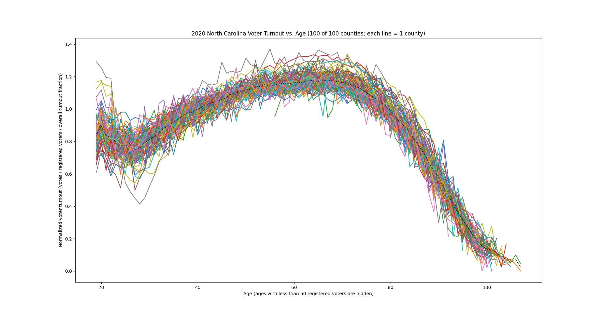

# Voting Machine Fraud in the State of North Carolina

This exposes the pattern between voter turnout and age caused by voting machine fraud in North Carolina in the 2020 General Presidential Election.

## Results

The following normalized turnout plots show how they converge to a common curve among all counties in the state. If you look at my other repositories, e.g. election-fraud-ohio, you will see that a similar convergence occurs, HOWEVER the exact curve is DIFFERENT, just by crossing state lines. This is not possible without fraud. All of the following normalized turnout plots use a 2020 voter roll.

## Setup

Requires python3. Before running, be sure you have enough free space for the downloaded and decompressed CSV files, about 15.5 GB.

## Running

1. Download voter and vote history files (see 'Data Source' section).
2. Move decompressed files to `./data/ncvoter_Statewide.txt` and `./data/ncvhis_Statewide.txt`.
3. To plot voter turnout lines vs. age for all counties on the same plot: `./plot_turnout_by_age.py`.

## Data Source

North Carolina provides the voter data for free.

Statewide voter history and registration files can be found here
(files are also split by county, look for 2 statewide files): https://dl.ncsbe.gov/?prefix=data/

